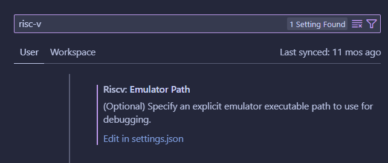

# ECE 2035 Class VSCode Extension

The companion extension to GaTech ECE 2035 Programming HW/SW Systems class. Supports RISC-V assembly development.

## Related Repositories

Emulator repository: [Here](https://github.com/danielcbailey/RISC-V-Emulator)

Example assignment repository: [Here](https://github.gatech.edu/ECEInnovation/RISCV-Assignments)

## Getting Started

This guide assumes you are looking to develop the extension or test a development preview of the extension.

Clone the repository and download/install Node.js on your computer. You can download that from [here](https://nodejs.org/en). Once Node.js is installed, navigate to the `ece2035` directory inside the repository from your terminal. Run the line `npm install` to download the dependencies and prepare for building the extension. Once npm has finished installing dependency packages, open the directory `ece2035` from VSCode. If successful, the Run/Debug panel on the left should have a green arrow to launch the extension at the top of the screen. Click this button to build and run a version of VSCode with the development extension enabled. To test the extension, you can make/open a .asm file, or open the example project folder `exampleProject` in the subdirectory `ece2035\assets\` .

**IMPORTANT:** You *must* have the RISC-V emulator built locally on your computer. To override the path of the emulator executable used:

1. Run the extension and while in its development host, go to the extension's **Settings** by navigating to (*File* -> *Preferences* -> *Settings*) and searching for `RISC-V`: 



Select `Edit in settings.json` and add the following JSON entry:
```json
"riscv.emulatorPath": "<absolute path to riscvemulator.exe>"
```

After restarting VSCode, the extension will automatically detect the overriden executable path.

## Current Features

Currently, the following features are working:
* Live warnings/errors of RISC-V assembly files